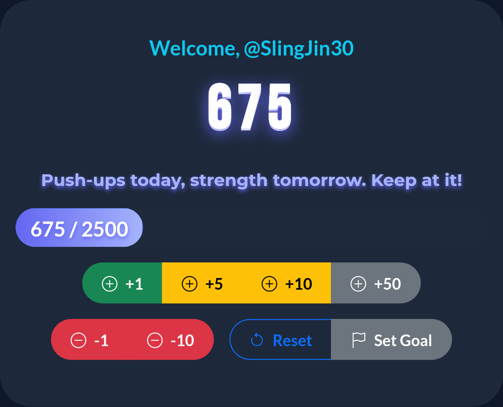

# Push-Up Counter

A modern, customisable push-up counter web app for personal fitness tracking. Features goal setting, motivational messages, user name personalisation, local progress saving, and instant progress screenshots. Built with Bootstrap and JavaScript.



---

## Features

- **Customisable Goals:** Set your daily push-up target and track your progress visually.
- **Motivational Messages:** Receive encouraging messages as you reach milestones.
- **Personalisation:** Enter your name for a personalised experience.
- **Local Progress Saving:** Your progress is saved locally in your browser—no sign-up required.
- **Instant Screenshots:** Capture and share your achievements with a single click.
- **Responsive Design:** Works seamlessly on desktop and mobile devices.
- **Australian English:** Spelling and terminology follow Australian standards.

---

## Need to Know

- **Live Demo:** Try it instantly at [countpushups.netlify.app](https://countpushups.netlify.app/)
- **No Account Needed:** All features work without registration or sign-in.
- **Data Privacy:** All your data stays on your device—nothing is uploaded or tracked.
- **Works Offline:** Once loaded, the app works without an internet connection.
- **Device Compatibility:** Fully functional on phones, tablets, laptops, and desktops.
- **Progress Reset:** You can reset your progress and settings at any time.
- **Custom Motivation:** Motivational messages can be edited in `js/messages.js` for a personal touch.
- **Screenshots:** Instantly save or share your progress with the built-in screenshot tool.
- **Accessibility:** Designed to be usable with keyboard and screen readers.
- **Australian Spelling:** All language follows Australian English conventions.
- **Open Source:** Free to use, modify, and share under the MIT License.

---

## Getting Started

1. **Clone the repository:**
   ```sh
   git clone https://github.com/slingjin30/pushupcounter.git
   cd pushupcounter
   ```

2. **Open `index.html` in your browser.**
   - No installation or server required.

---

## Usage

- Enter your name and set your daily push-up goal.
- Click the counter button each time you complete a push-up.
- Progress and settings are saved automatically in your browser.
- Use the screenshot feature to save or share your progress.

---

## Customisation

- All settings are accessible from the main interface.
- You can reset your progress at any time.

---

## Privacy

- No personal data is sent to any external server; all app features work entirely in your browser.
- Your progress and settings are stored locally in your browser using `localStorage`.
- The app is hosted on Netlify, which may collect standard web server logs (such as IP address and access times) for operational and analytics purposes. No user-specific fitness data is transmitted or stored by the app itself.

---

## Support

- For issues or feature requests, please open an issue on GitHub.
- Contributions are welcome via pull requests.

---

## License

This project is licensed under the MIT License.

---

